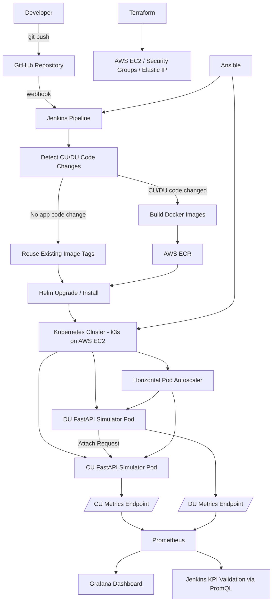

# Telecom RAN Simulator DevOps Platform on AWS

## Project Overview

This project was built as a hands-on DevOps + AWS learning platform to simulate a simplified telecom RAN (Radio Access Network) attach flow using cloud-native technologies.

The goal of the project is to demonstrate practical DevOps engineering skills relevant to modern telecom and cloud environments, including:

- CI/CD pipeline automation
- Kubernetes deployments using Helm
- Docker image build and deployment workflows
- AWS infrastructure provisioning
- Horizontal Pod Autoscaling (HPA)
- Prometheus + Grafana observability
- KPI-driven validation pipelines
- Infrastructure automation using Terraform and Ansible

The project was designed and implemented from the perspective of a telecom QA/System Testing engineer transitioning into DevOps and AWS-focused engineering roles.

---

# Architecture Overview

## High-Level Flow

```text
GitHub Push
     ↓
Jenkins CI/CD Pipeline
     ↓
Docker Image Build
     ↓
AWS ECR Push
     ↓
Helm Deployment
     ↓
Kubernetes (k3s)
     ↓
CU / DU Simulator Pods
     ↓
Prometheus Metrics Scraping
     ↓
Grafana Dashboards + KPI Validation
```

## Architecture Diagram



---

# Core Components

| Component | Purpose |
|---|---|
| CU Simulator | Simulates Central Unit attach handling |
| DU Simulator | Simulates Distributed Unit RACH + attach requests |
| Jenkins | CI/CD orchestration |
| Docker | Containerization |
| AWS ECR | Container image registry |
| Kubernetes (k3s) | Container orchestration platform |
| Helm | Kubernetes package/deployment management |
| Prometheus | Metrics collection |
| Grafana | Observability dashboards |
| Terraform | AWS infrastructure provisioning |
| Ansible | EC2 + Kubernetes environment automation |

---

# Tech Stack

## Cloud & Infrastructure

- AWS EC2
- AWS ECR
- Terraform
- Ansible

## Container & Orchestration

- Docker
- Kubernetes (k3s)
- Helm

## CI/CD

- Jenkins
- GitHub Webhooks

## Observability

- Prometheus
- Grafana
- Kubernetes HPA

## Application Layer

- Python
- FastAPI

---

# CI/CD Pipeline Workflow

The Jenkins pipeline performs the following:

1. Detects whether CU or DU application code changed
2. Builds Docker images only when required
3. Pushes images to AWS ECR
4. Updates Kubernetes image pull secrets
5. Deploys applications using Helm
6. Performs rollout validation
7. Executes automated load testing
8. Validates KPIs using Prometheus PromQL queries
9. Fails the pipeline if KPI thresholds are not met

---

# Kubernetes Deployment Design

The project deploys CU and DU services as Kubernetes Deployments managed through Helm templates.

Features implemented:

- Configurable Helm values
- Resource requests and limits
- Readiness probes
- Liveness probes
- Horizontal Pod Autoscaler (HPA)
- Controlled rollout behavior
- ReplicaSet history control

---

# Observability Design

Prometheus scrapes metrics exposed by both CU and DU services.

Grafana dashboards visualize:

- RACH Success Rate
- Attach Success Rate
- Request counts
- Failure counts
- Min/Max/Average latency
- HPA scaling behavior
- Build-specific KPI data using pipeline_run_id labels

KPI validation inside Jenkins uses Prometheus PromQL queries as the source of truth.

---

# Horizontal Pod Autoscaling (HPA)

The project includes Kubernetes HPA-based scaling experiments.

Implemented features:

- CPU-based autoscaling
- Automatic scale-out and scale-in validation
- Dynamic load testing through Jenkins
- Configurable request intensity
- Prometheus/Grafana validation of scaling behavior

Example scaling behavior:

```text
1 pod → 2 pods → 3 pods
3 pods → 2 pods → 1 pod
```

---

# Infrastructure Automation

## Terraform

Terraform is used to provision:

- AWS EC2 instances
- Security Groups
- Elastic IP configuration

## Ansible

Ansible is used to automate:

- Kubernetes node setup
- Jenkins setup
- Tool installation
- kubeconfig preparation
- Deployment prerequisites

---

# Reliability Features

The platform includes multiple production-style reliability mechanisms:

- Kubernetes readiness probes
- Kubernetes liveness probes
- Automated pod recovery
- KPI-based pipeline gating
- Prometheus-backed validation
- Persistent Grafana storage
- HPA stabilization behavior

---

# Current Deployment Model

Current deployment environment:

- Single-node Kubernetes cluster using k3s
- AWS EC2 hosted environment
- Jenkins running on EC2
- Grafana exposed through Kubernetes NodePort

---

# Future Roadmap

Planned future enhancements:

- Migration from k3s to AWS EKS
- Ingress Controller integration
- GitHub Actions pipeline
- Advanced Prometheus alerting
- CloudWatch integration
- Multi-node Kubernetes cluster
- Canary deployments
- ArgoCD/GitOps experimentation

---

# Learning Goals

This project was created to:

- Build practical DevOps engineering experience
- Learn Kubernetes deeply through hands-on implementation
- Understand observability engineering concepts
- Learn AWS infrastructure automation
- Build production-style CI/CD workflows
- Create a strong DevOps portfolio project for telecom + cloud engineering roles
